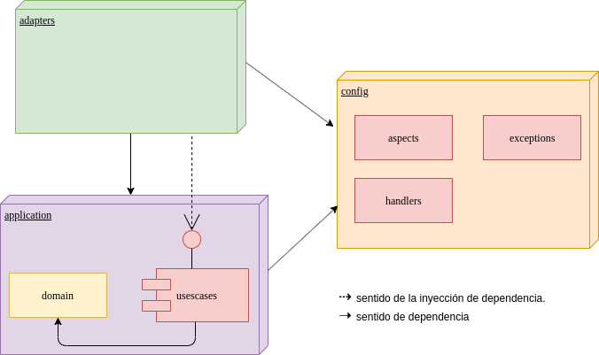

# Getting Started

### <a name="java-version"></a>Java version
La version que java que se va a utilizar es la 11.0.5 basada en el OpenJDK.

Esta la pueden descargar [aqui](https://github.com/AdoptOpenJDK/openjdk11-upstream-binaries/releases/tag/jdk-11.0.5%2B10).
También se puede instalar usando [SdkMan](https://sdkman.io/), version 11.0.5-open.


### <a name="run-application"></a>Run application
desde la raiz del proyecto ejecutar el siguiente comando:
```shell script
./gradlew bootRun
```

### <a name="darchitecture"></a>Architecture

Basado en los principios de Clean Architecture.


## Estructura de paquetes

Se definió la siguiente taxonomía de paquetes:

   * **application:** Encapsula toda la lógica de negocio y el modelo del dominio.
        * **domain:** Contiene entidades del dominio. Representa el nucleo de toda la aplicación.
        * **usescases:** Abstracción de los casos de uso del sistema. Contiene además la definición de los puertos y excepciones.
   * **adapters:** Representa la capa de adaptadores (como su nombre indica) que se conectarán en los puertos expuestos por el sistema
   * **config:** Capa transversal a toda la aplicación que contendrá las distintas configuraciones y aspectos del microservicio.
        

